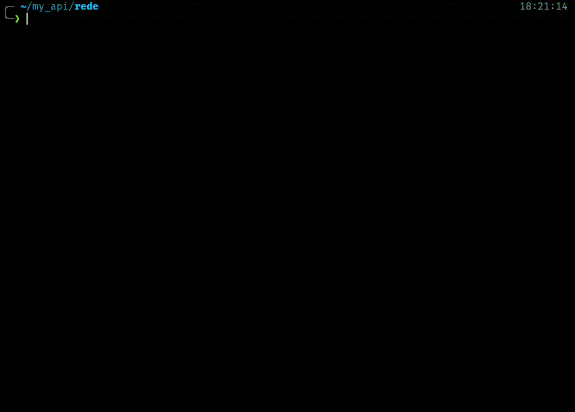
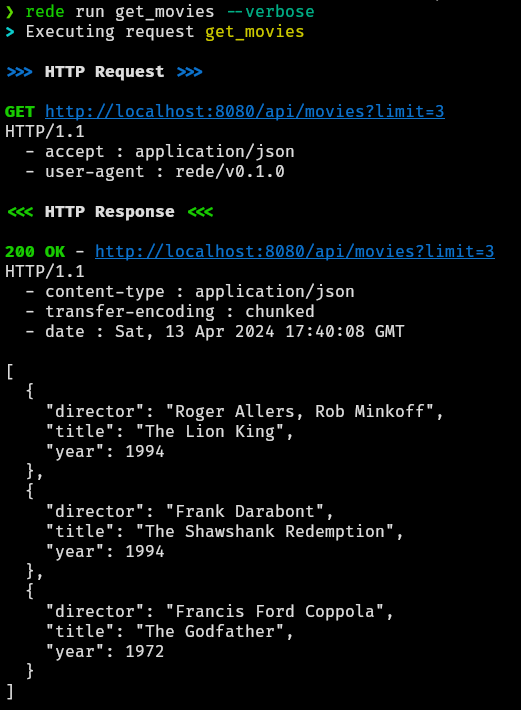

# Rede
[](https://github.com/kriogenia/rede/actions/workflows/ci.yml)


`rede` (galician word for "net") is a command-line utility to help run suites of requests to
ease the usage and testing of REST APIs. The main inspiration for this project comes from
[Bruno](https://www.usebruno.com/) and their command line tool.

The main goal behind this project is to have a suite of text files representing HTTP requests
that will be picked and executed by `rede`, allowing for easy sharing and control versioning
of these requests.



The `--verbose` looks good too:



## Installation

As this still an early stage of the project the only way of installing it is using cargo, so
you would need to have Rust installed and run:

```shell
cargo install rede
```

## How to run

`rede` works using a DSL of TOML schemas. All the documentation regarding rede DSL is still under
development, but a request to get a couple of dog facts would look like this:

```toml
[http]
method = "GET"
url = "https://dogapi.dog/api/v2/facts"

[headers]
Accept = "application/json"
User-Agent = "rede/v0.1.0"

[query_params]
limit = 2
```

You can generate this same request executing the `rede example` command. Then, once you have a
valid request like the one generated by the example you only need to run it with rede:

```shell
rede run <your_file>
```

## What's next

`rede` is still in the early stage of its development. The following versions should make it
capable of an executing like the following one.


Imagine the following file `./request.toml` in your project.

```toml
[http]
method = "POST"
url = "{{host}}/v1/movies"

[metadata]
name = "Add new movie"
api_version = "v1"

[input_params]
title = "string"

[input_params.release_date]
type = "string"
hint = 'Release date in format "YYYY-MM-DD"'
default = '{{utils.today("YYYY-MM-DD")}}'

[headers]
Content-Type = "application/json"
Authorization = "Bearer {{token}}"

body.json = '''
{
  "title": {{title}},
  "release_date": {{release_date}},
  "debug": true
}
'''
```

And imagine that you also have a `./env/local.toml` file like this:

```toml
host = "http://localhost:8080"
token = "MyPersonalToken"
```

Then from your project you could run `rede` and this would happen:

```
$ rede run --env local request
  Running request "Add new movie"
  Please, insert: `title` (string):
$ The Lion King
  Please, insert: Release date in format "YYYY-MM-DD"
  Send empty line to use default: "2024-02-29"
$ 1994-10-07

  >> HTTP Request >>
  POST localhost:8080/v1/movies
  HTTP/2.0
    - Content-Type: application/json
    - Authorization: Bearer MyPersonalToken

  [application/json]
  { "title": "The Lion King", "release_date": "1994-10-07", "debug": true }

  << HTTP Response <<
  201 Created
  HTTP/2.0
    - Content-Type application/json

  { "id": 1, "title": "The Lion King", "release_date": "1994-10-07" }
```

This is the idea behind `rede`, creating parametrizable and reusable request in TOML
format that can be used from the command line to test you APIs.
But there's still a long road ahead before this is the reality.