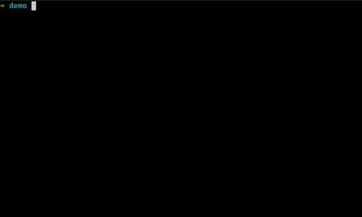

# Rede

[](https://github.com/kriogenia/rede/actions/workflows/ci.yml)


`rede` (galician word for "net") is a command-line utility to help run suites
of requests to ease the usage and testing of REST APIs. The main inspiration
for this project comes from [Bruno](https://www.usebruno.com/) and their
command line tool.

The main goal behind this project is to have a suite of text files
representing HTTP requests that will be picked and executed by `rede`,
allowing for easy sharing and control versioning of these requests.



The `--verbose` looks good too:


## Installation

As this still an early stage of the project the only way of installing it is
using cargo, so you would need to have Rust installed and run:

```shell
cargo install rede
```

You can also build it yourself (adding `--no-default-features` you can install
the minimal version)

```shell
git clone https://github.com/kriogenia/rede.git
cargo build -p rede
```

## How to run

`rede` works using a DSL of TOML schemas. All the documentation regarding
rede DSL is still under development, but a request to get a couple of
good boy facts would look like this:

```toml
[http]
method = "GET"
url = "https://dogapi.dog/api/v2/facts"

[headers]
Accept = "application/json"
User-Agent = "rede/v0.1.0"

[query_params]
limit = 2
```

You can generate a similar but more feature-rich request executing the
`rede example` command. Then, once you have a valid request like the
one generated by the example you only need to run it with rede:

```shell
rede run <your_file>
```

## Local development

In order to work with `rede` while collaborating in the project or
working in your own fork you'll need to specify the package you
plan to build or run. For example, to build the parser from the
root, just run:

```sh
cargo build -p rede_parser
```

And if you plan to execute a request with the compiled binary you
can do something like:

```sh
cargo run -p rede -- example
```

It is also possible to just navigate to the package directory and
work from there:

```sh
cd placeholders
cargo build
```
