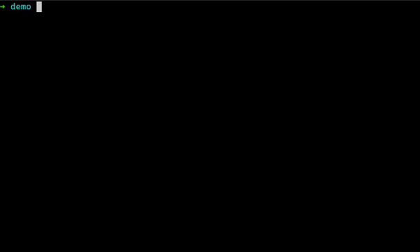
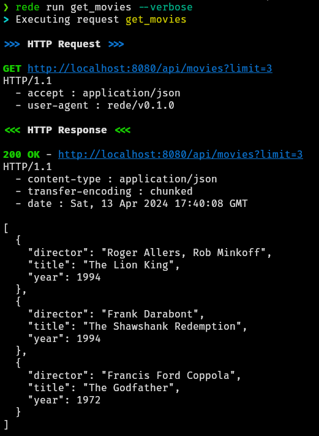

# Rede

`rede` (galician word for "net") is a command-line utility to help run suites
of requests to ease the usage and testing of REST APIs. The main inspiration
for this project comes from [Bruno](https://www.usebruno.com/) and their command
line tool.

The main goal behind this project is to have a suite of text files representing
HTTP requests that will be picked and executed by `rede`, allowing for easy sharing
and control versioning of these requests.



## Request DSL

Rede requests are stored as plain text files, so they can be easily stored and
shared in your project repositories via your favourite version control tool.
You won't have to set a team with your peers to have a shared suite of request
to test your application, you only need to push those files.

The DSL that `rede` uses is based on TOML as it's a simple and human-readable
format that matches perfectly our needs. This is an example of a request that
rede can execute:

```toml
[http]
method = "GET"
url = "https://dogapi.dog/api/v2/facts"

[headers]
Accept = "application/json"
User-Agent = "rede/v0.1.0"

[query_params]
limit = 1
```

Pretty easy to digest, right?

## rede run

The main feature of `rede` is the command `run`. You can invoke it with the
name of the file of your request and rede will execute it and return the results.



